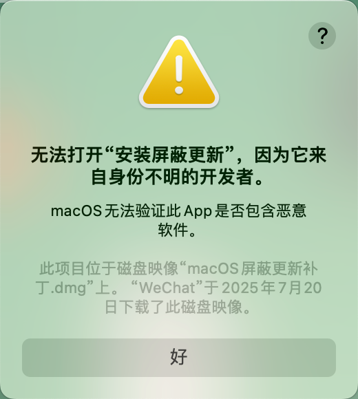
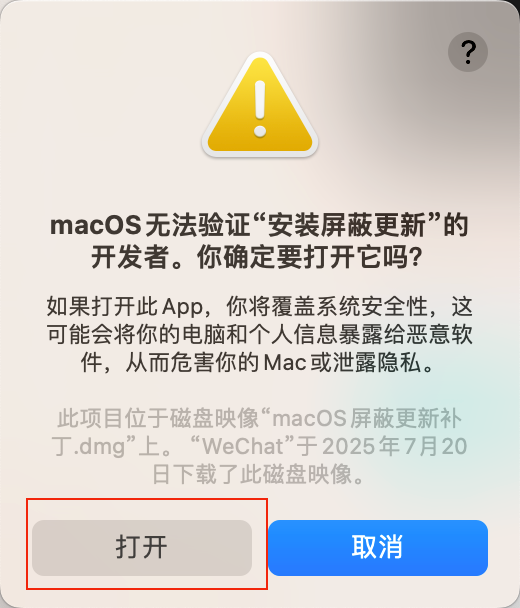
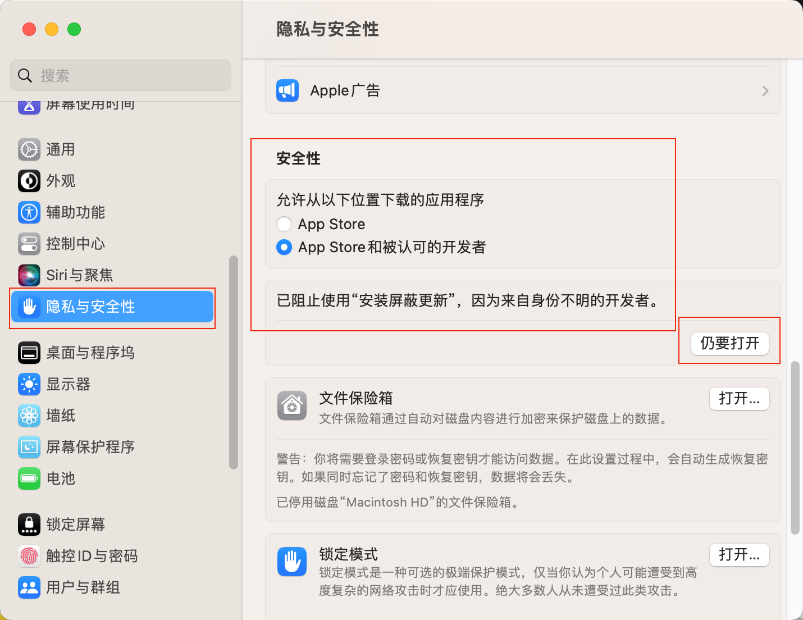

  <h2>
    macOS 更新屏蔽工具
  </h2>

## 📦 安装步骤：

1️⃣ 双击 "安装屏蔽更新" 文件

2️⃣ 输入您的管理员密码（密码输入时可见）

3️⃣ 按回车键确认运行

4️⃣ 等待安装完成

---

## 🗑️ 卸载步骤：

1️⃣ 双击 "卸载屏蔽更新" 文件

2️⃣ 输入您的管理员密码（密码输入时可见）

3️⃣ 按回车键确认运行

4️⃣ 等待卸载完成

---

## ⚠️ 重要提示：

• 密码仅存在于本地，不会被上传或存储

• 如有安全疑问，可咨询 ChatGPT

• 建议在安装前备份系统

• 此工具仅适用于 macOS 系统

---

## 🔧 技术支持：

Tools By XRSec

Enjoy! 🎉

---

## 👌疑难解答：

无法打开“安装屏蔽更新”，因为它来自身份不明的开发者。

    
    

